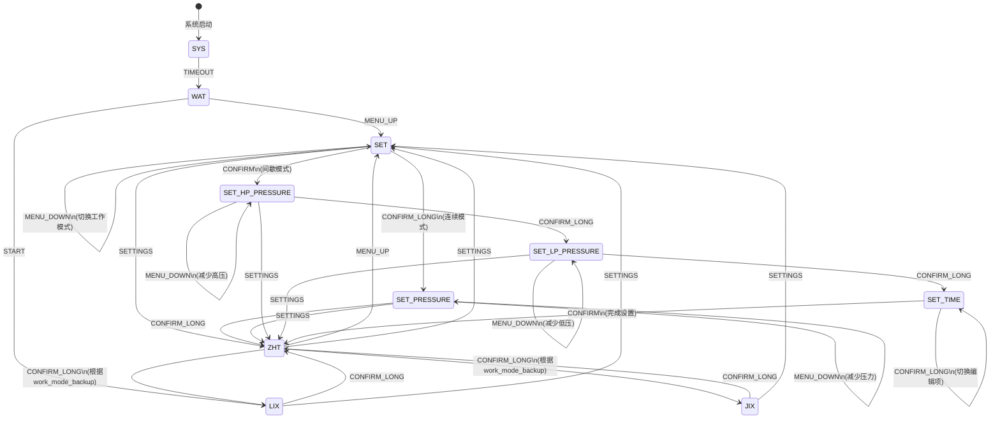

# UI状态机转换图

## 状态定义

- **SYS**: 系统初始化模式
- **WAT**: 等待指令模式（待机）
- **LIX**: 连续工作模式
- **JIX**: 间歇工作模式
- **ZHT**: 暂停模式
- **SET**: 参数设定模式（模式选择界面）
- **SET_PRESSURE**: 连续模式压力设置界面
- **SET_HP_PRESSURE**: 间歇模式高压设置界面
- **SET_LP_PRESSURE**: 间歇模式低压设置界面
- **SET_TIME**: 间歇模式时间设置界面

## 事件定义

- **TIMEOUT**: 超时事件
- **MENU_UP**: 菜单向上
- **MENU_DOWN**: 菜单向下
- **START**: 启动治疗
- **CONFIRM**: 确认键
- **CONFIRM_LONG**: 确认键长按释放
- **SETTINGS**: 设置键

## 状态转换图

## 详细转换表

| 序号 | 当前状态 | 触发事件 | 下一状态 | 说明 |
|------|---------|---------|---------|------|
| 0 | SYS | TIMEOUT | WAT | 初始化超时后进入待机 |
| 1 | WAT | MENU_UP | SET | 菜单向上进入设置 |
| 2 | WAT | START | LIX | 启动进入连续模式 |
| 3 | LIX | CONFIRM_LONG | ZHT | 长按确认进入暂停 |
| 4 | LIX | SETTINGS | SET | 设置键进入设置 |
| 5 | JIX | CONFIRM_LONG | ZHT | 长按确认进入暂停 |
| 6 | JIX | SETTINGS | SET | 设置键进入设置 |
| 7 | ZHT | MENU_UP | SET | 向上键进入设置 |
| 8 | ZHT | SETTINGS | SET | 设置键进入设置 |
| 9 | ZHT | CONFIRM_LONG | LIX/JIX | 长按确认恢复治疗（根据work_mode_backup） |
| 10 | SET | SETTINGS | ZHT | 设置键退出到暂停 |
| 11 | SET | MENU_UP | SET | 向上键切换工作模式 |
| 12 | SET | MENU_DOWN | SET | 向下键切换工作模式 |
| 13 | SET | CONFIRM_LONG | SET_PRESSURE | 连续模式进入压力设置 |
| 14 | SET | CONFIRM | SET_HP_PRESSURE | 间歇模式进入高压设置 |
| 15-16 | SET_PRESSURE | MENU_UP/DOWN | SET_PRESSURE | 调整压力值 |
| 17-18 | SET_PRESSURE | CONFIRM_LONG/SETTINGS | ZHT | 退出到暂停 |
| 19-20 | SET_HP_PRESSURE | MENU_UP/DOWN | SET_HP_PRESSURE | 调整高压值 |
| 21 | SET_HP_PRESSURE | CONFIRM_LONG | SET_LP_PRESSURE | 进入低压设置 |
| 22 | SET_HP_PRESSURE | SETTINGS | ZHT | 退出到暂停 |
| 23-24 | SET_LP_PRESSURE | MENU_UP/DOWN | SET_LP_PRESSURE | 调整低压值 |
| 25 | SET_LP_PRESSURE | CONFIRM_LONG | SET_TIME | 进入时间设置 |
| 26 | SET_LP_PRESSURE | SETTINGS | ZHT | 退出到暂停 |
| 27-28 | SET_TIME | MENU_UP/DOWN | SET_TIME | 调整时间值 |
| 29 | SET_TIME | CONFIRM_LONG | SET_TIME | 切换编辑项 |
| 30 | SET_TIME | CONFIRM | ZHT | 完成设置退出 |

